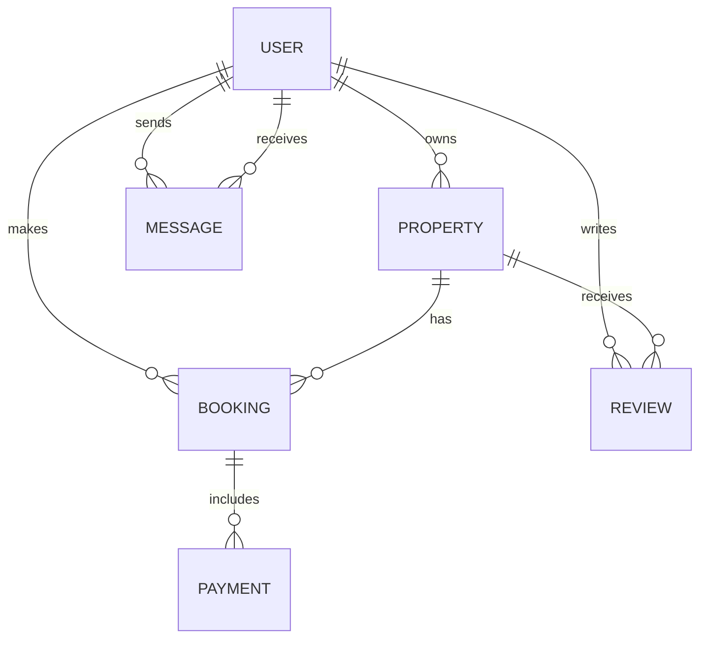

<!-----
This is used to describe the database specification intuitively
----->

# Airbnb Database Specification

## Overview

This document outlines the database schema for an Airbnb-like platform, detailing entities, attributes, relationships, and best practices. It supports user management, property listings, bookings, payments, reviews, and messaging, ensuring data integrity, scalability, and clarity.

---

## Entities and Attributes

### User

| Column        | Type                          | Constraints                              |

| ------------- | ----------------------------- | ---------------------------------------- |

| **user_id**       | UUID                          | Primary Key, Indexed                     |

| **first_name**    | VARCHAR(50)                   | NOT NULL                                 |

| **last_name**     | VARCHAR(50)                   | NOT NULL                                 |

| **email**         | VARCHAR(100)                  | UNIQUE, NOT NULL                         |

| **password_hash** | VARCHAR(255)                  | NOT NULL                                 |

| **phone_number**  | VARCHAR(20)                   | NULL                                     |

| **role**          | ENUM('guest','host','admin')  | NOT NULL                                 |

| **created_at**    | TIMESTAMP                     | DEFAULT CURRENT_TIMESTAMP                |

### Property

| Column             | Type                  | Constraints                                  |

| ------------------ | --------------------- | -------------------------------------------- |

| **property_id**       | UUID                  | Primary Key, Indexed                        |

| **host_id**           | UUID                  | Foreign Key → User(user_id), NOT NULL       |

| **name**              | VARCHAR(100)          | NOT NULL                                    |

| **description**       | TEXT                  | NOT NULL                                    |

| **location**          | VARCHAR(255)          | NOT NULL                                    |

| **price_per_night**   | DECIMAL(10,2)         | NOT NULL                                    |

| **created_at**        | TIMESTAMP             | DEFAULT CURRENT_TIMESTAMP                   |

| **updated_at**        | TIMESTAMP             | ON UPDATE CURRENT_TIMESTAMP                 |

### Booking

| Column        | Type                                | Constraints                                      |

| ------------- | ----------------------------------- | ------------------------------------------------ |

| **booking_id**    | UUID                                | Primary Key, Indexed                             |

| **property_id**   | UUID                                | Foreign Key → Property(property_id), NOT NULL    |

| **user_id**       | UUID                                | Foreign Key → User(user_id), NOT NULL            |

| **start_date**    | DATE                                | NOT NULL                                         |

| **end_date**      | DATE                                | NOT NULL                                         |

| **total_price**   | DECIMAL(10,2)                       | NOT NULL                                         |

| **status**        | ENUM('pending','confirmed','canceled') | NOT NULL                                      |

| **created_at**    | TIMESTAMP                           | DEFAULT CURRENT_TIMESTAMP                        |

### Payment

| Column           | Type                                | Constraints                                      |

| ---------------- | ----------------------------------- | ------------------------------------------------ |

| **payment_id**      | UUID                                | Primary Key, Indexed                             |

| **booking_id**      | UUID                                | Foreign Key → Booking(booking_id), NOT NULL      |

| **amount**          | DECIMAL(10,2)                       | NOT NULL                                         |

| **payment_date**    | TIMESTAMP                           | DEFAULT CURRENT_TIMESTAMP                        |

| **payment_method**  | ENUM('credit_card','paypal','stripe') | NOT NULL                                      |

### Review

| Column        | Type                                | Constraints                                      |

| ------------- | ----------------------------------- | ------------------------------------------------ |

| **review_id**     | UUID                                | Primary Key, Indexed                             |

| **property_id**   | UUID                                | Foreign Key → Property(property_id), NOT NULL    |

| **user_id**       | UUID                                | Foreign Key → User(user_id), NOT NULL            |

| **rating**        | INTEGER                             | CHECK (rating ≥ 1 AND rating ≤ 5), NOT NULL       |

| **comment**       | TEXT                                | NOT NULL                                         |

| **created_at**    | TIMESTAMP                           | DEFAULT CURRENT_TIMESTAMP                        |

### Message

| Column         | Type                  | Constraints                               |

| -------------- | --------------------- | ----------------------------------------- |

| **message_id**    | UUID                  | Primary Key, Indexed                      |

| **sender_id**     | UUID                  | Foreign Key → User(user_id), NOT NULL     |

| **recipient_id**  | UUID                  | Foreign Key → User(user_id), NOT NULL     |

| **message_body**  | TEXT                  | NOT NULL                                  |

| **sent_at**       | TIMESTAMP             | DEFAULT CURRENT_TIMESTAMP                 |

---

## Relationships

- **User → Property (1:M):**  

  A host user can own multiple properties; each property belongs to exactly one host.

- **User → Booking (1:M):**  

  A guest user can make multiple bookings; each booking is linked to one guest.

- **Property → Booking (1:M):**  

  A property can have multiple bookings; each booking references one property.

- **Booking → Payment (1:M):**  

  A booking can have multiple payments; each payment is tied to one booking.

- **User → Review (1:M):**  

  A guest user can write multiple reviews; each review is authored by one user.

- **Property → Review (1:M):**  

  A property can receive multiple reviews; each review pertains to one property.

- **User → Message (1:M) as Sender:**  

  A user can send multiple messages; each message has exactly one sender.

- **User → Message (1:M) as Recipient:**  

  A user can receive multiple messages; each message has exactly one recipient.

---

## Illustration

---
